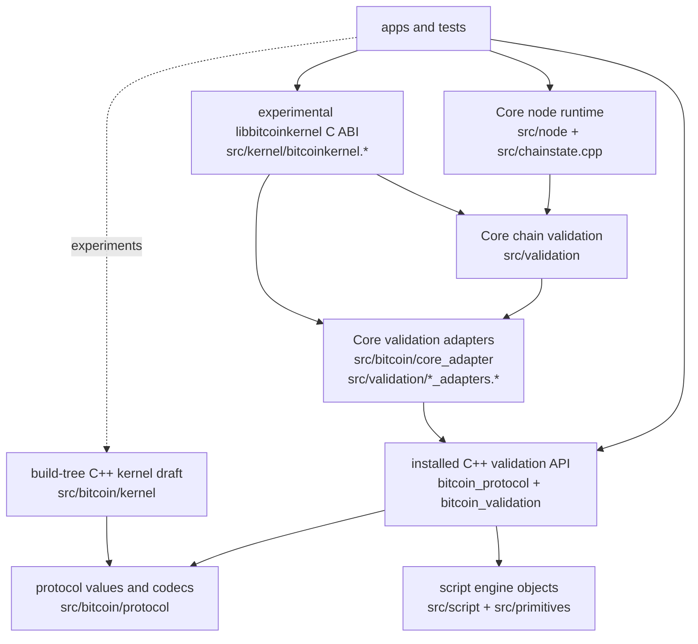

# champy

a lil project for moving fast n' breakin stuff. dont use, not safe, etc.

# local reasoning

a lot of this project is to experiment with ideas inspired by local value
semantics, namely:

- make domain vocabulary into ordinary values: see `transaction`, `outpoint`,
  `coin`, `verification_flags`, and the parse results in
  [src/bitcoin/protocol](src/bitcoin/protocol).
- pass runtime context explicitly: validation takes `validation_time`,
  `consensus_params`, `spend_context`, `chain_view`, and coin-source concepts
  instead of reaching through globals; see
  [src/bitcoin/validation/context.h](src/bitcoin/validation/context.h) and
  [src/bitcoin/validation/verify.h](src/bitcoin/validation/verify.h).
- keep Core state at the edge: conversion and lookup glue lives in
  [src/bitcoin/core_adapter](src/bitcoin/core_adapter) and
  `src/validation/*_adapters.*`, not in the validation vocabulary.
- prefer structural requirements over inheritance: `chain_view`, `coin_index`,
  and `fallible_coin_source` describe what an input must do without owning it;
  see [src/bitcoin/protocol/coin_index.h](src/bitcoin/protocol/coin_index.h).
- return facts and decisions as values: validation functions produce typed
  results such as `verify_result<block_facts>` rather than mutating hidden
  output state.

# error handling

error handling keeps consensus rejection separate from operational failure.
`validation_rejection` means "the candidate is invalid"; `operation_error`
means "the caller or runtime could not complete the operation"; assertions and
`invariant_violation` are for broken programmer assumptions at boundaries. The
main example is [src/bitcoin/validation/result.h](src/bitcoin/validation/result.h):
`verify_result<T>` is an `operation_result<validation_decision<T>>`, so invalid
data and unavailable data cannot collapse into the same state.

The practical test case is coin lookup:
[src/bitcoin/validation/spend.cpp](src/bitcoin/validation/spend.cpp) maps
missing or spent coins to validation decisions, but maps unavailable, malformed,
interrupted, or failed storage to `operation_error_code` values.
