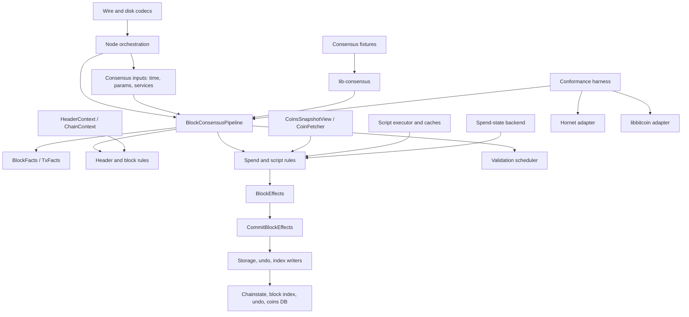

# Consensus Architecture

This document describes the target architecture for Champy's consensus code.
The goal is a consensus engine that is correct, fast, testable, and usable by
different node implementations.

The design keeps current consensus behavior while replacing implicit coupling
with explicit inputs, outputs, and mutation boundaries.

## Goals

- Keep consensus behavior unchanged during migration.
- Make every consensus rule locally reasoned: explicit inputs, explicit output,
  no hidden chainstate access.
- Keep consensus stages explicit.
- Move mutation to a small commit layer.
- Build toward a standalone consensus library with portable test fixtures.
- Make side effects injectable for tests, fuzzing, and alternate storage.
- Allow different spend-state backends, including non-UTXO validation models.
- Allow different consensus execution models without changing consensus
  results.
- Support conformance testing against Core, Hornet, and libbitcoin.
- Keep hot paths benchmarked and allocation-aware.

## Non-goals

- Do not rewrite validation in one pass.
- Do not copy Hornet or libbitcoin internals directly.
- Do not expose a stable external API before the internal API is proven.
- Do not require one storage backend, coin model, or scheduler.
- Do not preserve current Core boundaries when they block testing or local
  reasoning.

## Architecture



## Layers

### Codecs

Codecs parse and serialize wire or disk bytes. Consensus rules do not parse
bytes and do not own wire-format diagnostics.

Example:

```cpp
std::optional<CBlock> DecodeBlock(std::span<const std::byte> bytes);
void EncodeBlock(const CBlock& block, ByteSink& sink);
```

### Library Boundary

The internal consensus API should be separable from node orchestration.

Example target:

```cpp
Consensus::Expected<BlockEffects, BlockValidationError> ValidateBlock(
    const ConsensusBlock& block,
    const ConsensusContext& context,
    SpendStateView& spend_state,
    ScriptExecutor& scripts);
```

`lib-consensus` should not depend on networking, mempool policy, wallet code,
RPC, logging configuration, file storage, or database implementations.

The library boundary is proven by tests before it is treated as stable:

```text
fixture -> lib-consensus -> result
fixture -> Core adapter -> result
fixture -> Hornet adapter -> result
fixture -> libbitcoin adapter -> result
```

The in-tree boundary test links the `bitcoin_consensus` target as a whole
archive. It validates structural rules, contextual rules, spend staging, script
completion, and commit interfaces using `SnapshotSpendState`. This catches
hidden dependencies on node, chainstate, block storage, Core UTXO adapters,
Core validation-state objects, and Core process utilities such as `util/check`.
It also checks the `bitcoin_consensus` CMake target source and link lists so the
library cannot silently grow a Core dependency.
`bitcoinkernel` also consumes `bitcoin_consensus` as a target instead of
recompiling consensus sources.

Consensus result types use `Consensus::Expected` and simple error structs.
Core maps those errors to `TxValidationState` or `BlockValidationState` in
adapter code.

### Vocabulary and Predicates

Vocabulary types and predicates describe protocol data without deciding
consensus validity.

Examples:

```cpp
Consensus::IsCoinbase(tx);
Consensus::HasWitness(tx);
Consensus::SignalsRBF(txin);
Consensus::HasRelativeLocktime(txin);
Consensus::LocktimeIsHeight(tx.nLockTime);
Consensus::IsUnspendable(txout);
```

Scripts use `Consensus::ScriptView` when rules only need serialized script
bytes:

```cpp
Consensus::ScriptView script_view{txout.scriptPubKey};
Consensus::IsPayToScriptHash(script_view);
Consensus::GetWitnessProgram(script_view);
Consensus::HasWitnessCommitmentPrefix(script_view);
```

Important distinction:

```cpp
Consensus::HasRelativeLocktime(txin);
```

This checks the input field only. It does not check transaction version,
deployment state, block height, or median time past. Those are consensus rule
inputs.

### Facts

`BlockFacts` is immutable data computed once for a validation attempt.

Examples:

```cpp
struct BlockFacts {
    uint256 merkle_root;
    bool merkle_mutated;
    int witness_commitment_index;
    bool has_witness;
    int64_t weight;
};
```

Rules consume facts instead of mutating `CBlock` cache fields. Facts can be
computed from Core's `CBlock` wrapper or from a transaction span plus exact
serialized-size observations:

```cpp
auto facts = Consensus::ComputeBlockFacts(
    transactions,
    stripped_block_size,
    block_weight);
```

This keeps block decoding and storage representation outside rule execution.

### Header Context

`BlockHeaderContext` is a value snapshot of the chain ancestry and deployment
state needed by header and block-contextual rules. It is constructed with the
needed values and then read through accessors.

Example:

```cpp
Consensus::BlockHeaderContext headers{
    height,
    previous_median_time_past,
    previous_block_time,
    Consensus::BlockDeploymentContext{
        .height_in_coinbase_active = height_in_coinbase_active,
        .csv_active = csv_active,
        .segwit_active = segwit_active,
    },
};

headers.Height();
headers.PreviousMedianTimePast();
headers.SegwitActive();
```

Rules consume copied context. They do not walk raw `CBlockIndex*` chains.

Core-specific helpers that translate `CBlockIndex` into explicit consensus
context belong outside `src/consensus`. Block spend validation receives
per-input sequence-lock time context through `SequenceLockTimeView`; the Core
adapter computes that value from `CBlockIndex` before the consensus rule runs.
`sequence_locks_adapters.{h,cpp}` keeps older `CBlockIndex` sequence-lock entry
points available outside the spend pipeline.

Time is an input to contextual validation. Consensus code should not call
`NodeClock::now()` directly.

Example:

```cpp
struct HeaderContext {
    int height;
    int64_t previous_median_time_past;
    int64_t max_block_time;
};
```

### Coins Context

`CoinsSnapshotView` is a read-only UTXO view for validation. It must not dirty
or populate parent caches on misses.

Example:

```cpp
class CoinsSnapshotView {
public:
    std::optional<Coin> GetCoin(const COutPoint& outpoint) const;
    bool HaveCoin(const COutPoint& outpoint) const;
};
```

Spend validation should depend on a spend-state interface, not directly on
Core's cache implementation.

Example:

```cpp
class SpendStateView {
public:
    bool HaveCoin(const COutPoint& outpoint) const;
    std::optional<CoinSnapshot> GetCoin(const COutPoint& outpoint) const;
};
```

`CoinSnapshot` carries all coin data needed by spend rules:

```cpp
struct CoinSnapshot {
    CTxOut output;
    int height;
    bool is_coinbase;
};
```

Time-based sequence-lock data is supplied by `SequenceLockTimeView`. This keeps
coin facts separate from chain-time lookup.

Block validation may need temporary intra-block state so later transactions can
spend outputs created earlier in the same block. Keep that mutation behind a
per-attempt workspace.

Example:

```cpp
class BlockSpendWorkspace {
public:
    const SpendStateView& StagedSpendView() const;
    const SequenceLockTimeView& SequenceLockTimes() const;
    void StageTransactionEffectsForIntraBlockView(
        const TransactionCoinEffects& effects,
        unsigned int transaction_index);
};
```

The parent spend-state backend creates the workspace:

```cpp
class BlockSpendBackend {
public:
    std::unique_ptr<BlockSpendWorkspace> BeginBlockSpend(
        const BlockSpendContext& context);
};
```

Dropping a workspace after a failed validation attempt must leave parent state
unchanged. Commit is the only boundary that publishes validated effects.

The first backend can stage through `CCoinsViewCache`. Later backends can use
different models.

Examples:

```text
CCoinsViewCache backend       -> normal UTXO validation
Snapshot backend              -> fixture and fuzz validation
Accumulator backend           -> SwiftSync-like validation
Indexed backend               -> libbitcoin-style layout
Utreexo backend               -> proof-backed UTXO membership validation
```

Backends may change performance and available proofs. They must not change
consensus results for the same fixture.

### Validation Stages

Validation remains staged:

```cpp
CheckBlockStructural(block, facts, params);
CheckBlockContextual(block, facts, headers, params, validation_time);
auto workspace = spend_backend.BeginBlockSpend(context);
ValidateAndStageBlockTransactions(block.vtx, *workspace, services);
CommitBlockEffects(commit_context, effects, revert_data_writer, spend_state_committer, metadata_committer);
```

The stages support cheap rejection, out-of-order block handling, pruning, undo
data, early relay, and ordered chain commits.

The stages also describe dependency ordering:

```text
unordered checks         -> structural
partially ordered checks -> contextual
fully ordered checks     -> spend and commit
```

Unordered checks depend only on the block or transaction data. Partially ordered
checks depend on chain context, height, time, or deployment state. Fully ordered
checks depend on the current spend state or publish mutations.

This model is useful for performance work. Unordered checks can be parallelized
early. Contextual checks can run from copied chain snapshots. Spend validation
can use alternate state backends. Commit stays ordered by block.

The spend stage is exposed as consensus-facing helpers:

```cpp
BlockPrecommitValidationView block_view{
    .header = header,
    .transactions = transactions,
    .facts = facts,
};
BlockStructuralValidationView structural_view{
    .header = header,
    .transactions = transactions,
    .facts = facts.structure,
};
BlockContextualBodyValidationView body_view{
    .transactions = transactions,
    .facts = facts,
};
BlockContextualValidationView contextual_view{
    .header = header,
    .body = body_view,
};

ValidateBlockStructuralStage(structural_view, structural_options);
ValidateBlockContextualBodyStage(body_view, contextual_body_options, debug_context);
ValidateBlockContextualStage(contextual_view, contextual_options);
ValidateBlockPrecommitStages(
    block_view, structural_options, contextual_options, consensus_context,
    workspace, script_checker, spend_options);
ValidateAndCommitBlockStages(
    block_view, structural_options, contextual_options, consensus_context,
    workspace, script_checker, spend_options,
    revert_data_writer, spend_state_committer, metadata_committer);
ValidateTransactionSpendForBlock(tx, spend_state, script_checker, context, options, accounting);
ValidateAndStageBlockTransactions(transactions, workspace, script_checker, context, options);
CommitBlockEffects(commit_context, effects, revert_data_writer, spend_state_committer, metadata_committer);
```

Core supplies adapters for header ancestry, UTXO state, script execution, and
commit effects. CBlock overloads remain as compatibility wrappers. The
extraction-facing entry points are the view overloads. Script-engine scratch
state stays behind `BlockScriptChecker`.

`BlockSpendBackend::BeginBlockSpend` runs before per-transaction spend
validation. Backends can use it to create block-scoped state, such as loading
or verifying accumulator proofs, without changing transaction rule code.

### Effects and Commit

Spend validation produces effects. It does not commit them.

Within spend validation, one validated input snapshot should feed all
UTXO-dependent transaction work:

```cpp
auto input_check = CheckTransactionInputsForBlock(tx, spend_state.StagedSpendView(), context);
if (!input_check) return input_check.error();

auto sigops = AddTransactionSigOpCostForBlock(tx, input_check->input_coins, flags);
auto effects = BuildTransactionCoinEffectsForBlock(tx, input_check->input_coins, height, previous_mtp);
auto scripts = BuildTransactionScriptCheckPlan(tx_ref, input_check->input_coins, flags);
script_checker.Check(scripts, txdata);
```

This avoids re-reading the UTXO view for fee checks, sigops, script spent
outputs, and effects.

`TransactionScriptCheckPlan` is data only: transaction, flags, and spent
outputs. Core owns execution policy, validation-cache access, and queueing in
its script-check adapter.

UTXO-dependent block rules belong on the same spend-validation path. Core can
still decide when historical rules apply, but the rule execution should return
the same diagnostics as transaction spend validation. For example, Core computes
whether BIP30 applies and passes that as a spend option; the no-overwrite check
runs inside `ValidateAndStageBlockTransactions`.

Spend-rule diagnostics are returned as data. Core maps them to
`BlockValidationState` at the adapter boundary.

Example:

```cpp
struct BlockSpendError {
    BlockConsensusIssue issue;
    std::string reject_reason;
    std::string debug_message;
};
```

`BlockConsensusIssue` is consensus-local. Core maps it to
`BlockValidationResult` only when filling `BlockValidationState`.

Context-independent transaction checks follow the same rule:

```cpp
auto result = Consensus::CheckTransaction(tx);
if (!result) {
    // result.error().reject_reason
}
```

The stateful `CheckTransaction(tx, TxValidationState&)` overload is a Core
adapter, not part of the consensus library.

Example:

```cpp
struct TransactionCoinEffects {
    std::vector<SpentCoinEffect> spends;
    std::vector<CreatedCoinEffect> creates;
};

struct BlockEffects {
    std::vector<TransactionCoinEffects> transaction_effects;
    CAmount fees;
    int64_t sigop_cost;
};
```

Block identity and publication metadata are commit context, not spend effects.

Spend validation may stage intra-block coin effects through `BlockSpendWorkspace`
so later transactions can spend earlier outputs from the same block. This
staged state is local to one validation attempt and can be dropped on failure.

Only the commit layer publishes staged coin effects to the parent spend state,
writes undo data, updates the block index, or changes the active chain.

Commit errors are stage errors, but they are not consensus-invalidity results.
Core maps them to runtime errors at the adapter boundary.

### Side Effects

Consensus rule evaluation should be testable with fake side effects.

Examples:

```cpp
class ValidationClock {
public:
    int64_t Now() const;
};

class RevertDataWriter {
public:
    Result<void, CommitError> WriteBlockRevertData(
        const CommitContext& context,
        const BlockEffects& effects);
};

class SpendStateCommitter {
public:
    Result<void, CommitError> CommitSpendState(
        const CommitContext& context,
        const BlockEffects& effects);
};

class MetadataCommitter {
public:
    Result<void, CommitError> CommitBlockMetadata(
        const CommitContext& context,
        const BlockEffects& effects);
};
```

Production code can implement these with `BlockManager`, `CCoinsViewCache`, and
the block index. Tests and fuzz targets can implement them in memory.

### Execution Model

Consensus results must not depend on the scheduler.

Examples:

```text
single-threaded validation
parallel script checks
pipeline: headers -> structural block -> spend validation -> commit
batch validation for fixtures
```

The scheduler may change when work runs. It must not change:

1. Valid or invalid result.
2. Consensus failure category.
3. Effects committed for a valid block.

Commit remains ordered by block even when earlier validation stages are
parallelized.

## Invariants

- Consensus functions do not read global time. Validation time is an input.
- Consensus functions do not acquire `cs_main` themselves.
- Consensus functions do not mutate chainstate.
- Consensus functions do not write files or databases directly.
- Consensus functions do not depend on a specific thread scheduler.
- Cache hits may change cost, not result.
- Validation order may affect first failure reason, but not valid/invalid.
- Views must not outlive the objects they project from.
- UTXO commits remain ordered by block.
- Alternate spend-state backends must agree on valid or invalid results.

## Local Reasoning Rules

Consensus APIs should make their dependencies visible at the call site.

Prefer:

```cpp
auto result = CheckSpend(tx, context, coins);
```

Over:

```cpp
CAmount fee;
CheckSpend(tx, coins, state, fee);
```

Rules:

1. Prefer returned result objects over output parameters.
2. Use mutable references only for explicit commit boundaries.
3. Treat pointers, references, spans, and views as projections. Their lifetime
   and ownership must be clear from the surrounding API.
4. Keep extrinsic relationships behind narrow objects. Examples: header
   ancestry, UTXO state, script execution, undo writes, block-index writes.
5. Keep rule functions free of logging, timing, lock acquisition, file writes,
   database writes, and scheduler choices.

Current production adapter boundaries:

```text
BlockPrecommitValidationView borrows header and transaction storage plus precomputed facts
BlockStructuralValidationView and BlockContextualValidationView expose stage-specific views
CoinsViewBlockSpendWorkspace stages one Core block-validation attempt through CCoinsViewCache
CoinsViewBlockSpendBackend creates Core CCoinsViewCache workspaces
CoreBlockConnectionAttempt owns the Core spend workspace, pipeline, and commit adapters for one ConnectBlock attempt
CoreBlockEffectsWriter writes Core undo data and block-index state
CoreBlockSpendStateCommitter flushes staged `CCoinsViewCache`
SnapshotSpendState creates isolated fixture and fuzz workspaces
BuildCoreBlockHeaderContext snapshots CBlockIndex and deployment state for production header context
ScriptView gives script predicates a byte-view vocabulary independent of CScript mutability
ParseExactBlockHex and related fixture helpers require complete parse with no trailing bytes
block_validation_policy.h owns Core BIP30 and block script-flag policy helpers
script_validation.h owns the Core transaction script-validation entry point
DirectBlockScriptChecker is available for cacheless fixtures
CoreBlockScriptChecker executes prepared TransactionScriptCheckPlan values and owns cache/queue effects
CScriptCheck supports borrowed and owning checks; queued block checks use the owning path
Core block-validation wrappers still map consensus diagnostics to BlockValidationState
validation_state.h owns TxValidationState, BlockValidationState, and policy/mempool result vocabulary
block_validation_result.h owns Core/node block-validation result vocabulary
tx_check_adapters.h owns the stateful CheckTransaction(tx, TxValidationState&) adapter
sequence_locks_adapters.h owns legacy CBlockIndex sequence-lock adapters outside the block spend pipeline
CChainParams owns DefaultAssumeValid; assumevalid is not part of Consensus::Params
```

These are adapter boundaries, not consensus-rule dependencies. New
consensus-facing APIs should not copy these shapes unless they sit at a commit
or adapter boundary.

## Migration Phases

1. Add vocabulary predicates and tests.
2. Add immutable block facts.
3. Extract structural block checks behind the existing `CheckBlock` wrapper.
4. Extract contextual block checks behind `BlockHeaderContext`.
5. Split spend validation from UTXO commit.
6. Add side-effect interfaces for time, undo, storage, and block-index writes.
7. Add `SpendStateView` and keep the existing UTXO cache as the first backend.
8. Add `BlockConsensusPipeline`.
9. Add the conformance fixture format and adapters.
10. Harden the `bitcoin_consensus` target and boundary test until the internal
    API is ready to publish as an external library.
11. Add alternate spend-state backends and scheduler implementations.

## Conformance

A conformance fixture should contain enough data to run the same consensus case
against Core, Hornet, and libbitcoin.

Fixture runners should execute stages in this order:

```text
structural -> contextual -> spend -> commit
```

The in-tree harness runs fixtures against `SnapshotSpendState` and
`CoinsViewBlockSpendBackend`.

Fixture byte strings are parsed with exact helpers:

```cpp
auto block = test::consensus::ParseExactBlockHex(hex);
auto txout = test::consensus::ParseExactTxOutHex(hex);
```

Invalid hex and trailing bytes are fixture errors. This keeps test vectors
unambiguous and makes round-trip tests useful.

Example:

```json
{
  "block": "<serialized block hex>",
  "headers": ["<serialized parent header hex>"],
  "network": "mainnet",
  "validation_time": 1710000000,
  "block_subsidy": 312500000,
  "spend_state": {
    "backend": "utxo",
    "coins": [
      {
        "outpoint": "<txid>:0",
        "height": 100,
        "previous_median_time_past": 1710000000,
        "coinbase": false,
        "output": "<serialized txout hex>"
      }
    ]
  },
  "spend_context": {
    "block_height": 101,
    "previous_median_time_past": 1710000000
  },
  "contextual_options": {
    "difficulty_adjustment_interval": 2016,
    "previous_block_time": 1710000000,
    "enforce_timewarp_protection": false,
    "height_in_coinbase_active": false,
    "der_signature_active": false,
    "cltv_active": false,
    "csv_active": false,
    "segwit_active": false
  },
  "spend_options": {
    "locktime_flags": 0,
    "script_flags": 0,
    "check_no_unspent_output_overwrite": false
  },
  "expected": {
    "valid": false,
    "stage": "spend",
    "reject_reason": "bad-txns-inputs-missingorspent",
    "fees": 0,
    "inputs": 0,
    "sigop_cost": 0
  }
}
```

UTXO fixtures may include `previous_median_time_past` beside each coin for BIP68
time-based sequence locks. The harness loads those values into
`SequenceLockTimeView`; if omitted, it uses the block-level
`spend_context.previous_median_time_past` fallback.

Compare in this order:

1. Valid or invalid.
2. Broad failure stage.
3. Exact reason only when validation order is intentionally aligned.

## Test Vectors

Test vectors should be independent of Core's database and block-index layout.

Minimum fields:

```json
{
  "network": "mainnet",
  "validation_time": 1710000000,
  "block_subsidy": 5000000000,
  "headers": ["<serialized header hex>"],
  "block": "<serialized block hex>",
  "spend_state": {
    "backend": "utxo",
    "coins": []
  },
  "spend_context": {
    "block_height": 1,
    "previous_median_time_past": 0
  },
  "contextual_options": {
    "difficulty_adjustment_interval": 2016,
    "previous_block_time": 0,
    "enforce_timewarp_protection": false,
    "height_in_coinbase_active": false,
    "der_signature_active": false,
    "cltv_active": false,
    "csv_active": false,
    "segwit_active": false
  },
  "spend_options": {
    "locktime_flags": 0,
    "script_flags": 0,
    "check_no_unspent_output_overwrite": false
  },
  "expected": {
    "valid": true,
    "stage": "commit",
    "fees": 0,
    "inputs": 1,
    "sigop_cost": 0
  }
}
```

The same fixture format should support later backends:

```json
{
  "spend_state": {
    "backend": "accumulator",
    "proof": "<backend-specific proof>"
  }
}
```

## First Implementation Slice

The first slice is intentionally small:

- Add a local Nix dev shell.
- Add this architecture document.
- Add `src/consensus/predicates.*`.
- Add focused predicate tests.
- Use predicates in behavior-identical validation checks.

This creates the first boundary without changing consensus behavior.
